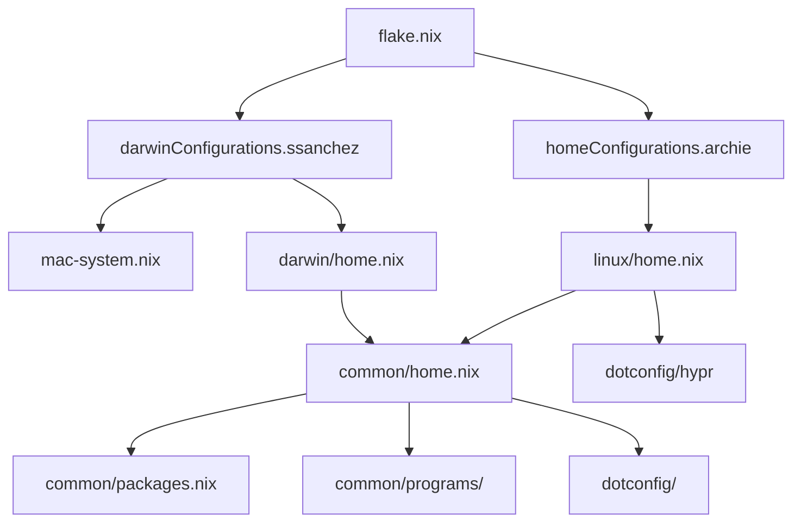

# Arch packages

Below are recommended package groups for a typical Arch Linux desktop setup. Install each group as needed.

## Core GUI Applications

```sh
yay -Syu --needed \
  1password baobab blueman calibre chromium dbeaver file-roller firefox gparted imv jetbrains-toolbox logseq-desktop-bin nautilus pavucontrol qbittorrent spotify strawberry stremio vesktop visual-studio-code-bin zathura zathura-pdf-mupdf
```

## Hyprland Ecosystem & Wayland Utilities

```sh
yay -Syu --needed \
  ags-hyprpanel-git grimblast-git hypridle hyprland hyprlock hyprpaper hyprpicker hyprshot rofi-lbonn-wayland-git swaync swww waybar wezterm-git wf-recorder-git wlsunset xdg-desktop-portal-wlr matugen-bin
```

## Gaming & Overlays

```sh
yay -Syu --needed \
  easyeffects goverlay lutris mangohud steam
```

## System Daemons & CLI Tools

```sh
yay -Syu --needed \
  btop brightnessctl bluez bluez-utils docker docker-compose git networkmanager power-profiles-daemon refind wireplumber wl-clipboard
```

## Base system setup

```sh
sudo pacman -S --needed base-devel git
```

## Install Nix

```sh
curl -fsSL https://install.determinate.systems/nix | sh -s -- install
```

## Install yay (AUR helper)

```sh
# Navigate to a directory where you can build packages (e.g., your home directory)
mkdir ~/git
cd ~/git

git clone https://aur.archlinux.org/yay.git
cd yay
makepkg -si
```

## Clone dotfiles and apply config

```sh
git clone https://github.com/Guisanpea/nixfiles ~/.dotfiles
~/.dotfiles/apply-arch.sh --no-git
```

## Post-installation setup

```sh
sudo mkdir /boot/EFI/refind/themes
sudo git clone https://github.com/catppuccin/refind.git /boot/EFI/refind/themes/catppuccin
sudo systemctl enable --now docker.service
sudo usermod -aG docker $USER
```

# Dotfiles Flake Structure

This repository manages user and system configuration for both Arch Linux and macOS using [Nix flakes](https://nixos.wiki/wiki/Flakes), [Home Manager](https://nix-community.github.io/home-manager/), and [nix-darwin](https://github.com/LnL7/nix-darwin). It provides a reproducible, modular, and cross-platform dotfiles setup.

---

## Structure Overview

```
.
├── flake.nix           # Flake entrypoint: defines inputs, outputs, and system/user configs
├── flake.lock          # Flake lock file (input versions)
├── common/             # Shared Home Manager modules (packages, programs, base home config)
│   ├── home.nix
│   ├── packages.nix
│   └── programs/
├── linux/              # Linux-specific Home Manager config
│   └── home.nix
├── darwin/             # macOS-specific Home Manager config
│   ├── home.nix
│   └── packages.nix
├── mac-system.nix      # System-level nix-darwin config (macOS)
├── dotconfig/          # Actual dotfiles (linked by Home Manager)
├── scripts/            # Helper scripts for applying configs, toggling apps, etc.
├── apply-arch.sh       # Script to apply Linux config
├── apply-mac.sh        # Script to apply macOS config
└── update.sh           # Script to update flake inputs
```

---

## Flake Outputs

- **darwinConfigurations.ssanchez**  
  System-level configuration for macOS, using nix-darwin and Home Manager.

- **homeConfigurations.archie**  
  User-level configuration for Arch Linux, using Home Manager.

---

## Directory Details

- **common/**  
  Shared Home Manager modules for all systems.  
  - `home.nix`: Common user config (xdg files, stateVersion, direnv, etc.)
  - `packages.nix`: Shared package list.
  - `programs/`: Modular program configs (git, zsh, php, etc.)

- **linux/**  
  Linux-specific Home Manager config.  
  - `home.nix`: Imports common modules and sets Linux-specific options (e.g., Xmodmap, session variables, Hyprland config).

- **darwin/**  
  macOS-specific Home Manager config.  
  - `home.nix`: Imports common modules and sets macOS-specific options (e.g., homeDirectory).
  - `packages.nix`: Extends common packages with macOS-only packages.

- **mac-system.nix**  
  System-level configuration for macOS, managed by nix-darwin.

- **dotconfig/**  
  All actual dotfiles (e.g., nvim, tmux, hypr, wezterm, etc.)  
  Linked into place by Home Manager.

- **scripts/**  
  Helper scripts for applying configs and toggling applications.

---

## Usage

### On Arch Linux

```sh
# Apply your Home Manager configuration
./apply-arch.sh
# To skip git commit/push after applying:
./apply-arch.sh --no-git
```

### On macOS

```sh
# Apply your nix-darwin + Home Manager configuration
./apply-mac.sh
# To skip git commit/push after applying:
./apply-mac.sh --no-git
```

### Update Flake Inputs

```sh
./update.sh
```

---

## Architecture Diagram



---

## Notes

- All dotfiles are managed declaratively via Nix and Home Manager.
- macOS system settings are managed via nix-darwin.
- The repository is designed for reproducibility and easy cross-platform management.
